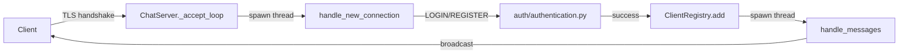

# TLSocket — Multi-Threaded TLS Chat System with RBAC & Security Logging

[](https://github.com/DevVoid-echoi/TLSocket/actions/workflows/ci.yml)
[](https://codecov.io/gh/DevVoid-echoi/TLSocket)
[](LICENSE)


A multi-threaded client/server chat system built on Python's standard library
(`socket`, `ssl`, `threading`). The focus is a security-centric architecture:
TLS-encrypted transport, user authentication, Role-Based Access Control (RBAC),
real-time administrative control from the server console, structured security
logging, brute-force / connection-flood detection, and an offline log-analysis
module.

---

## Key Features

| Tính năng | Mô tả |
|---|---|
| TLS transport | Mọi kết nối bọc `ssl`, cert trong `certs/` |
| RBAC | `admin`/`moderator`/`user`, gate qua `auth/rbac.py` |
| Brute-force protection | Block IP tạm thời sau N lần login sai (`security/brute_force_detection.py`) |
| Structured logging | JSON-lines, `logs/server.log` + `logs/security.log` |
| Observability | Prometheus `/metrics` + Grafana dashboard sẵn |
| Log analyzer | CLI `tlsocket-analyze` — thống kê, `--follow`, JSON/table |

---

## Project Structure

```text
src/tlsocket/
├── config.py                     # HOST/PORT, limits, thresholds, runtime file paths
├── auth/
│   ├── authentication.py         # register / login / set_user_role, password hashing
│   ├── password.py               # (constants)
│   └── rbac.py                   # Permission + ROLES_PERMISSIONS, has_permission()
├── security/
│   ├── validation.py             # nickname / message / command validation
│   ├── brute_force_detection.py  # BruteForceDetector (stateful, persisted to data/)
│   └── logger.py                 # alert logger
├── client_side/
│   ├── client.py                 # client entry point (tlsocket-client)
│   └── client_management/
│       ├── connection.py         # receive / write loops, read_line
│       └── instructions.py       # role-aware help text
├── server_side/
│   ├── server.py                 # server entry point (tlsocket-server) + console thread
│   ├── handlers/
│   │   ├── client_handler.py     # client registry, broadcast, message loop, cleanup
│   │   ├── ban_handler.py        # ban-list file I/O
│   │   └── lock.py               # shared locks
│   └── logs_management/
│       └── record_logs.py        # log_event(), logger setup
└── log_parser/
    ├── main.py                   # CLI entry point (tlsocket-analyze)
    ├── parser.py                 # stream parser (generator)
    ├── analyzer.py               # aggregation
    └── models.py                 # LogRecord dataclass

tests/                            # brute-force / DDoS simulation scripts
data/                             # user.json, ban.txt, brute_force_state.json (gitignored)
certs/                            # server.crt / server.key (gitignored)
logs/                             # *.log (gitignored)
```

Runtime files (`data/`, `logs/`, `certs/`) live under the project root by
default, regardless of the directory you launch from. Override with `TLSOCKET_DATA_DIR`, `TLSOCKET_LOG_DIR`, `TLSOCKET_CERT_DIR` (or
`TLSOCKET_CERT_FILE` / `TLSOCKET_KEY_FILE`), plus `TLSOCKET_HOST` /
`TLSOCKET_PORT`. See `.env.example`.



---

## Getting Started

### Prerequisites

* Python 3.10+ (developed on 3.12). Runtime dependency: `argon2-cffi`
  (password hashing).
* A TLS key pair. Generate a self-signed pair for local dev:

  ```bash
  ./scripts/gen_certs.sh
  ```

  > **Dev only.** This is a self-signed certificate with SAN entries for
  > `localhost` / `127.0.0.1` — fine for local development, but browsers/
  > clients elsewhere will not trust it. In production, use a certificate
  > from a real CA (e.g. [Let's Encrypt](https://letsencrypt.org/)) instead
  > of `scripts/gen_certs.sh`.

## Quickstart
```bash
pip install -e ".[dev]" && ./scripts/gen_certs.sh
tlsocket-server &
tlsocket-client
```

### Analyze the logs

```bash
tlsocket-analyze -f security         # or: -f server
tlsocket-analyze -f security -o report.json
```

---

## Commands

### Server console (typed into the server terminal)

| Command | Effect |
| --- | --- |
| `/set <username> <role>` | Assign `admin` / `moderator` / `user` |
| `/kick <username>` | Disconnect an online user |
| `/ban <username>` | Add to ban list and disconnect if online |
| `/unban <username>` | Remove from ban list |

### Client chat room

| Command | Permission | Effect |
| --- | --- | --- |
| `/quit`, `/exit` | — | Leave the chat |
| `/kick <username>` | KICK | Remove a user |
| `/ban <username>` | BAN | Ban a user |
| `/unban <username>` | UNBAN | Lift a ban |
| `/set <username> <role>` | SET | Change a user's role |

Anything else typed is sent as a chat message.

---

## Log Format

Logs are JSON Lines: one JSON object per line, `ts` in UTC (ISO 8601, not the
server's local time). `ip`/`extra_info` are omitted when not applicable.

```json
{"level": "INFO", "event": "LOGIN_SUCCESS", "username": "alice", "ip": "127.0.0.1", "ts": "2026-08-27T15:00:15.120345+00:00"}
{"level": "WARNING", "event": "LOGIN_FAILED", "username": "bob", "ip": "127.0.0.1", "extra_info": "reason=BANNED", "ts": "2026-08-27T15:00:22.480112+00:00"}
{"level": "WARNING", "event": "BRUTE_FORCE_ATTEMPT", "ip": "10.0.0.7", "failed_attempts": 5, "window_seconds": 60, "ts": "2026-08-27T15:01:05.007731+00:00"}
```

Files: `logs/server.log` (connections, logins), `logs/security.log` (auth,
admin actions, failures), `logs/alerts.log` (brute-force alerts only).

### Log analyzer CLI

```bash
tlsocket-analyze security                    # or: server, alerts, or a path
tlsocket-analyze security --format json -o report.json
tlsocket-analyze security --since 1h
tlsocket-analyze security --follow           # tail -f style, live
python -m tlsocket.log_parser security       # equivalent to tlsocket-analyze
```

Reports include request/login/ban counts, top 5 IPs, peak attack hours,
top targeted usernames, and a brute-force/DDoS alert flag.

---

## Observability

The server exposes Prometheus metrics on `/metrics` (`TLSOCKET_METRICS_PORT`,
default `9100`): connection counts, login/registration attempts by result,
messages relayed, and currently-blocked IPs.

```bash
docker compose up --build
```

This starts the server (ports `9999` chat, `9100` metrics), Prometheus
(`:9090`, scraping tlsocket every 5s), and Grafana (`:3000`, admin/admin,
anonymous viewer access enabled) with a pre-provisioned "TLSocket" dashboard.

<!-- TODO: screenshot of the Grafana dashboard after generating some traffic -->
<!--  -->

---

## Security

See [`docs/SECURITY.md`](docs/SECURITY.md) for the threat model — what's
mitigated, how, and the known limitations — plus how to report a
vulnerability.
