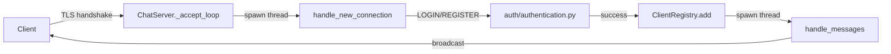
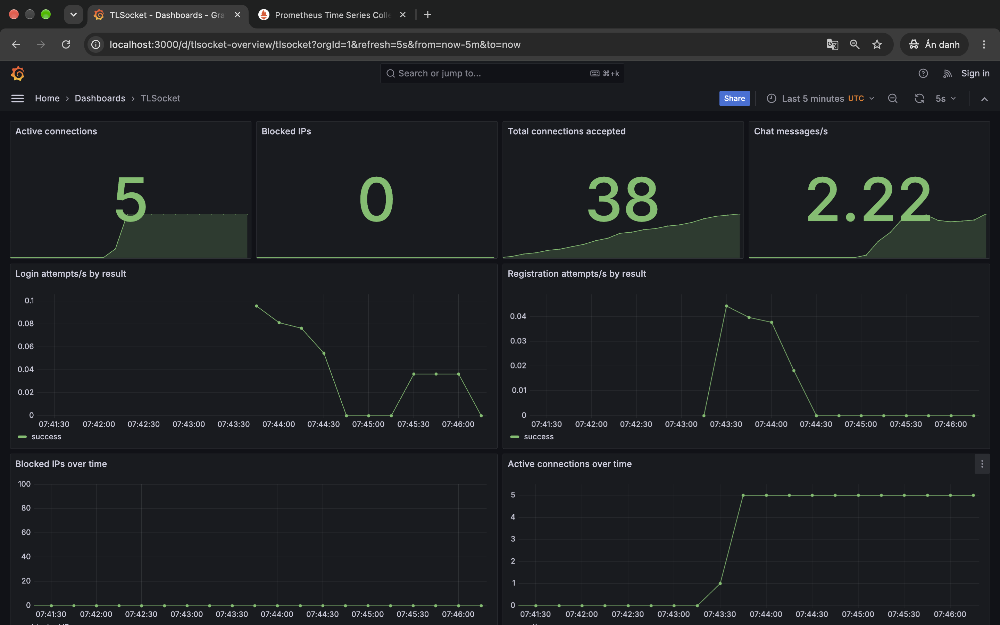
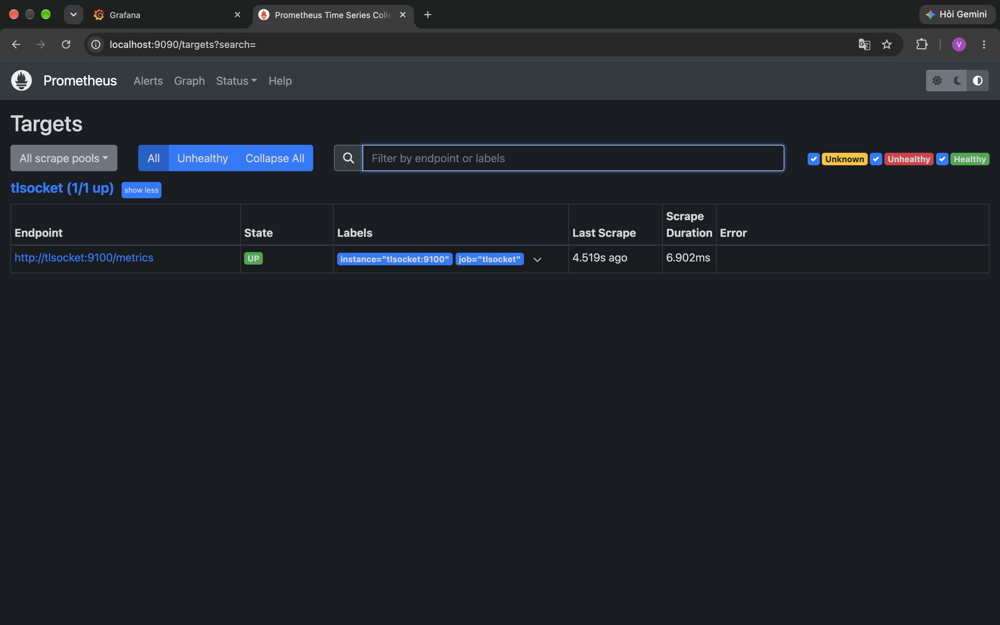

# TLSocket — TLS Chat Server with Authentication, RBAC, Threat Detection, Observability & Log Analysis

[](https://github.com/DevVoid-echoi/TLSocket/actions/workflows/ci.yml)
[](https://codecov.io/gh/DevVoid-echoi/TLSocket)
[](LICENSE)


TLSocket is a multi-threaded TLS chat server built on Python's standard
library (`socket`, `ssl`, `threading`) — but the chat protocol is really the
workload that exercises a broader system. Five parts work together
end-to-end: **TLS transport** with Argon2id **authentication**; **RBAC**
(`admin`/`moderator`/`user`) enforced server-side, including live
administrative control from the server console; **security controls**
(brute-force detection, connection-flood limits, input validation) that feed
the same structured logs; a **Prometheus/Grafana observability stack** for
real-time metrics; and an **offline log-analysis CLI** for post-hoc
investigation of that same log data. Each part is covered in more depth
below and in [`docs/`](docs/).

---

## Key Features

| Feature | Description |
|---|---|
| TLS transport | Every connection wrapped in `ssl`, cert in `certs/` |
| Authentication | Argon2id password hashing, transparent migration from legacy hashes (`auth/authentication.py`) |
| RBAC | `admin`/`moderator`/`user`, enforced server-side via `auth/rbac.py` |
| Security controls | Brute-force detection + connection-flood / rate limits (`security/`) |
| Structured logging | JSON-lines, `logs/server.log` + `logs/security.log` |
| Observability | Prometheus `/metrics` + pre-provisioned Grafana dashboard, Docker Compose stack |
| Log analyzer | CLI `tlsocket-analyze` — analytics, `--follow`, JSON/table output |

---

## Project Structure

```text
src/tlsocket/
├── config.py                     # HOST/PORT, limits, thresholds, runtime file paths
├── protocol.py                   # Command/ErrorCode enums, line-protocol formatting
├── metrics.py                    # Prometheus metrics (connections, logins, messages...)
├── logging_config.py             # dictConfig for JSON-lines logging
├── auth/
│   ├── authentication.py         # register / login / set_user_role, password hashing
│   └── rbac.py                   # Permission + ROLES_PERMISSIONS, has_permission(), role hierarchy via ROLE_RANK/can_act_on()
├── security/
│   ├── validation.py             # nickname / message / command validation
│   ├── brute_force_detection.py  # BruteForceDetector (stateful, persisted to data/)
│   ├── rate_limiter.py           # SlidingWindowLimiter (flood/register/message rate)
│   └── logger.py                 # alert logger
├── client_side/
│   ├── client.py                 # client entry point (tlsocket-client)
│   └── client_management/
│       ├── connection.py         # receive / write loops, read_line
│       └── instructions.py       # role-aware help text
├── server_side/
│   ├── server.py                 # server entry point (tlsocket-server) + console thread
│   ├── client_registry.py        # ClientRegistry: sessions, per-IP caps, per-client send queue + writer thread
│   ├── handlers/
│   │   ├── client_handler.py     # broadcast, message loop, cleanup
│   │   └── ban_handler.py        # ban-list file I/O
│   └── logs_management/
│       └── record_logs.py        # log_event(), logger setup
└── log_parser/
    ├── main.py                   # CLI entry point (tlsocket-analyze)
    ├── parser.py                 # stream parser (generator)
    ├── analyzer.py               # aggregation
    ├── filters.py                # --since / time-window filtering
    ├── report.py                 # JSON/table report builder
    └── models.py                 # LogRecord dataclass

tests/                            # pytest suite (unit/ + integration/)
benchmarks/                       # load test harness + brute-force/DDoS simulation scripts
docs/                             # ARCHITECTURE.md, DECISIONS.md, SECURITY.md, BENCHMARKS.md
deploy/                           # Prometheus + Grafana provisioning
scripts/                          # gen_certs.sh, healthcheck.py
data/                             # user.json, ban.txt, brute_force_state.json (gitignored)
certs/                            # server.crt / server.key (gitignored)
logs/                             # *.log (gitignored)
```

Runtime files (`data/`, `logs/`, `certs/`) live under the project root by
default, regardless of the directory you launch from. Override with `TLSOCKET_DATA_DIR`, `TLSOCKET_LOG_DIR`, `TLSOCKET_CERT_DIR` (or
`TLSOCKET_CERT_FILE` / `TLSOCKET_KEY_FILE`), plus `TLSOCKET_HOST` /
`TLSOCKET_PORT`. See `.env.example`.


```mermaid
flowchart LR
    C[Client] -- TLS handshake --> S[ChatServer._accept_loop]
    S -- spawn thread --> H[handle_new_connection]
    H -- LOGIN/REGISTER --> A[auth/authentication.py]
    A -- success --> R[ClientRegistry.add]
    R -- spawn thread --> M[handle_messages]
    M -- broadcast --> C
```

---

## Getting Started

### Prerequisites

* Python 3.10+ (developed on 3.12). Runtime dependencies: `argon2-cffi`
  (password hashing), `python-json-logger`, `prometheus-client`.
* A TLS key pair. Generate a self-signed pair for local dev:

  ```bash
  ./scripts/gen_certs.sh
  ```

  > **Dev only.** This is a self-signed certificate with SAN entries for
  > `localhost` / `127.0.0.1` — fine for local development, but browsers/
  > clients elsewhere will not trust it. In production, use a certificate
  > from a real CA (e.g. [Let's Encrypt](https://letsencrypt.org/)) instead
  > of `scripts/gen_certs.sh`.

## Quickstart
```bash
pip install -e ".[dev]" && ./scripts/gen_certs.sh
tlsocket-server &
tlsocket-client
```

### Analyze the logs

```bash
tlsocket-analyze security            # or: server, alerts
tlsocket-analyze security -o report.json
```

---

## Commands

### Server console (typed into the server terminal)

| Command | Effect |
| --- | --- |
| `/set <username> <role>` | Assign `admin` / `moderator` / `user` |
| `/kick <username>` | Disconnect an online user |
| `/ban <username>` | Add to ban list and disconnect if online |
| `/unban <username>` | Remove from ban list |

### Client chat room

| Command | Permission | Effect |
| --- | --- | --- |
| `/quit`, `/exit` | — | Leave the chat |
| `/kick <username>` | KICK | Remove a user |
| `/ban <username>` | BAN | Ban a user |
| `/unban <username>` | UNBAN | Lift a ban |
| `/set <username> <role>` | SET | Change a user's role |

Anything else typed is sent as a chat message.

---

## Log Format

Logs are JSON Lines: one JSON object per line, `ts` in UTC (ISO 8601, not the
server's local time). `ip`/`extra_info` are omitted when not applicable.

```json
{"level": "INFO", "event": "LOGIN_SUCCESS", "username": "alice", "ip": "127.0.0.1", "ts": "2026-08-27T15:00:15.120345+00:00"}
{"level": "WARNING", "event": "LOGIN_FAILED", "username": "bob", "ip": "127.0.0.1", "extra_info": "reason=BANNED", "ts": "2026-08-27T15:00:22.480112+00:00"}
{"level": "WARNING", "event": "BRUTE_FORCE_ATTEMPT", "ip": "10.0.0.7", "failed_attempts": 5, "window_seconds": 60, "ts": "2026-08-27T15:01:05.007731+00:00"}
```

Files: `logs/server.log` (connections, logins), `logs/security.log` (auth,
admin actions, failures), `logs/alerts.log` (brute-force alerts only).

### Log analyzer CLI

```bash
tlsocket-analyze security                    # or: server, alerts, or a path
tlsocket-analyze security --format json -o report.json
tlsocket-analyze security --since 1h
tlsocket-analyze security --follow           # tail -f style, live
python -m tlsocket.log_parser security       # equivalent to tlsocket-analyze
```

Reports include request/login/ban counts, top 5 IPs, peak attack hours,
top targeted usernames, and a brute-force/DDoS alert flag.

---

## Observability

The server exposes Prometheus metrics on `/metrics` (`TLSOCKET_METRICS_PORT`,
default `9100`): connection counts, login/registration attempts by result,
messages relayed, and currently-blocked IPs.

```bash
./scripts/gen_certs.sh   # if certs/ does not exist yet — docker-compose.yml mounts it into the container
docker compose up --build
```

This starts the server (ports `9999` chat, `9100` metrics), Prometheus
(`:9090`, scraping tlsocket every 5s), and Grafana (`:3000`, admin/admin,
anonymous viewer access enabled) with a pre-provisioned "TLSocket" dashboard.




---

## Security

See [`docs/SECURITY.md`](docs/SECURITY.md) for the threat model — what's
mitigated, how, and the known limitations — plus how to report a
vulnerability.
