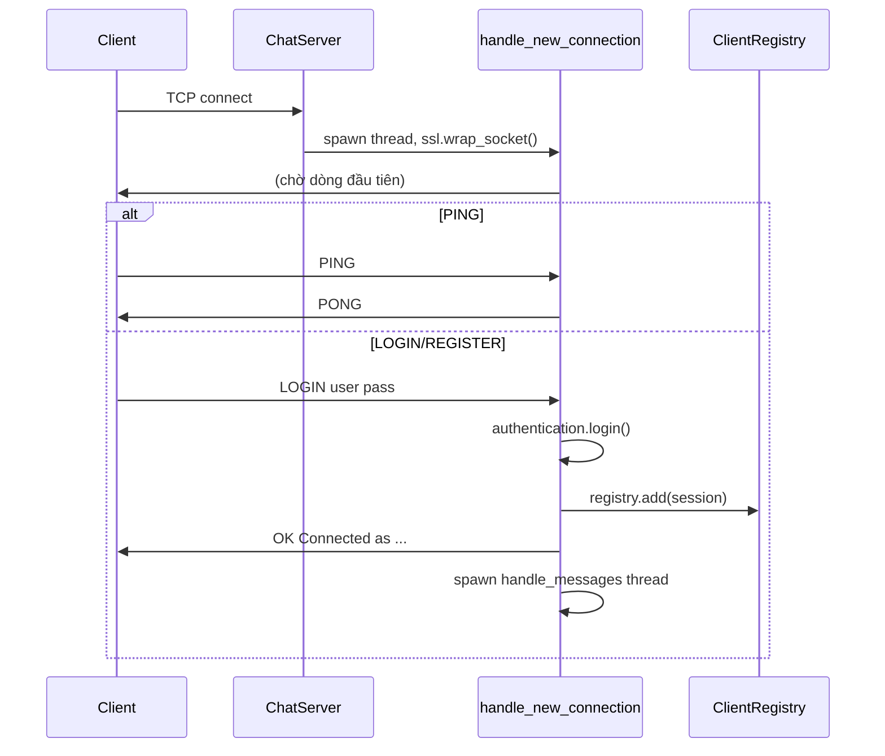
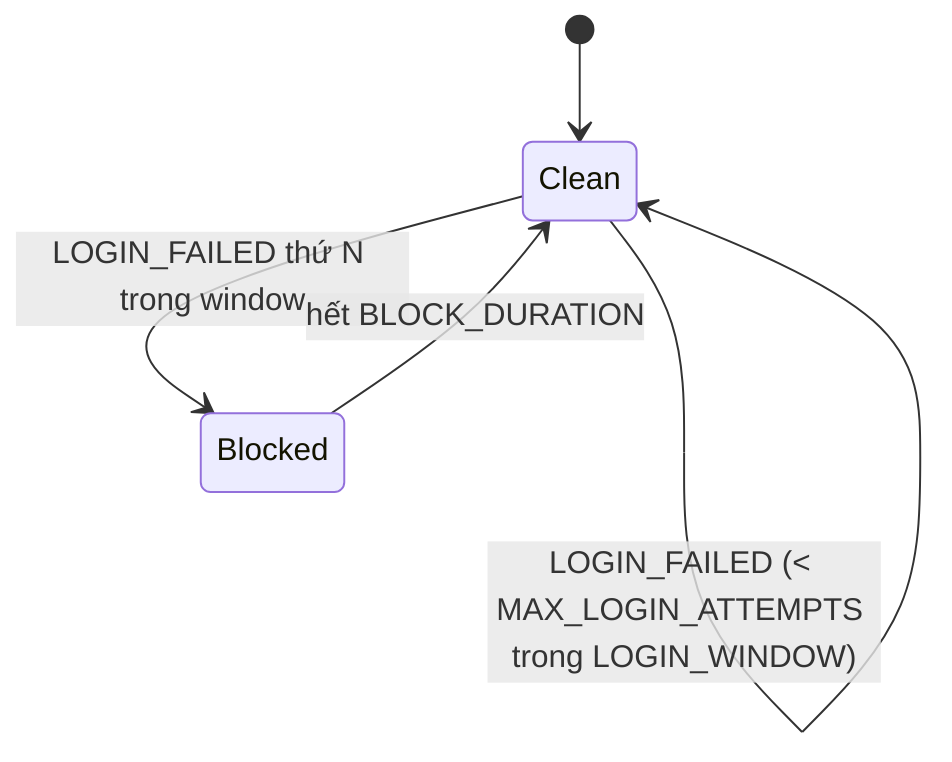

## Threading

- 1 thread `_accept_loop` chấp nhận kết nối, spawn 1 thread `handle_new_connection` mỗi client.
- Sau khi login, mỗi client có thêm 1 thread `handle_messages` đọc tin nhắn liên tục.
- State dùng chung được bảo vệ bởi:
  - `ClientRegistry._lock` — bảo vệ `_sessions`, `_by_name`, `_client_ips`, `_ip_counts`.
  - `ClientRegistry._send_lock` — serialize ghi socket khi nhiều thread broadcast cùng lúc.
  - `SlidingWindowLimiter._lock` — bảo vệ state rate-limit (login/register/message flood).

> Lưu ý: `server_side/handlers/lock.py` (`state_lock`, `ip_lock`) là code cũ không còn được dùng — nên xoá trong 1 PR dọn dẹp riêng.

