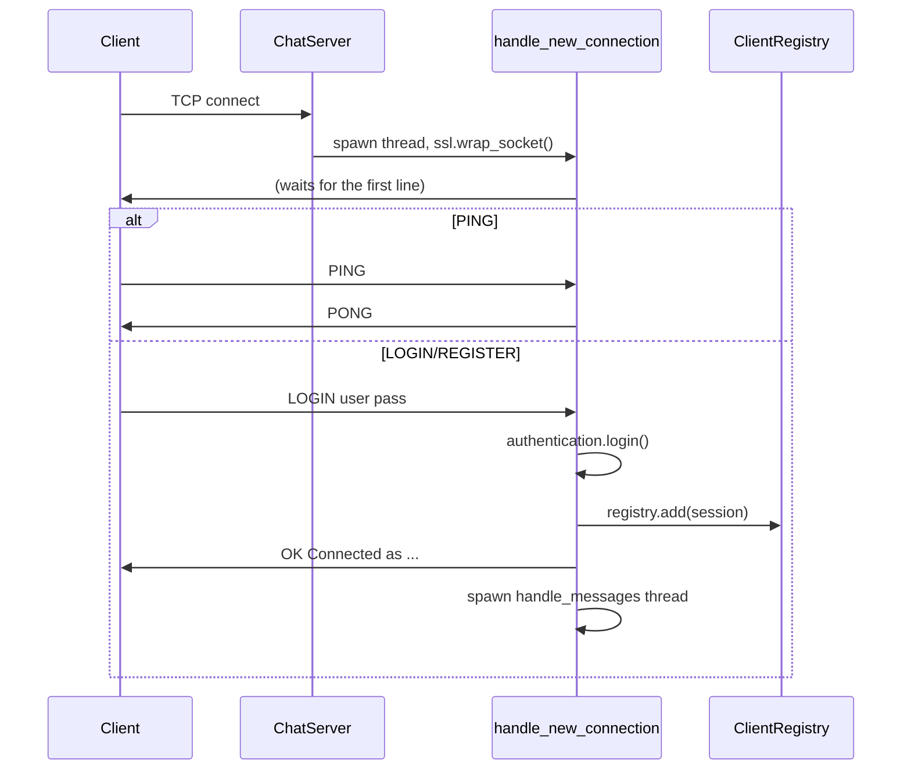
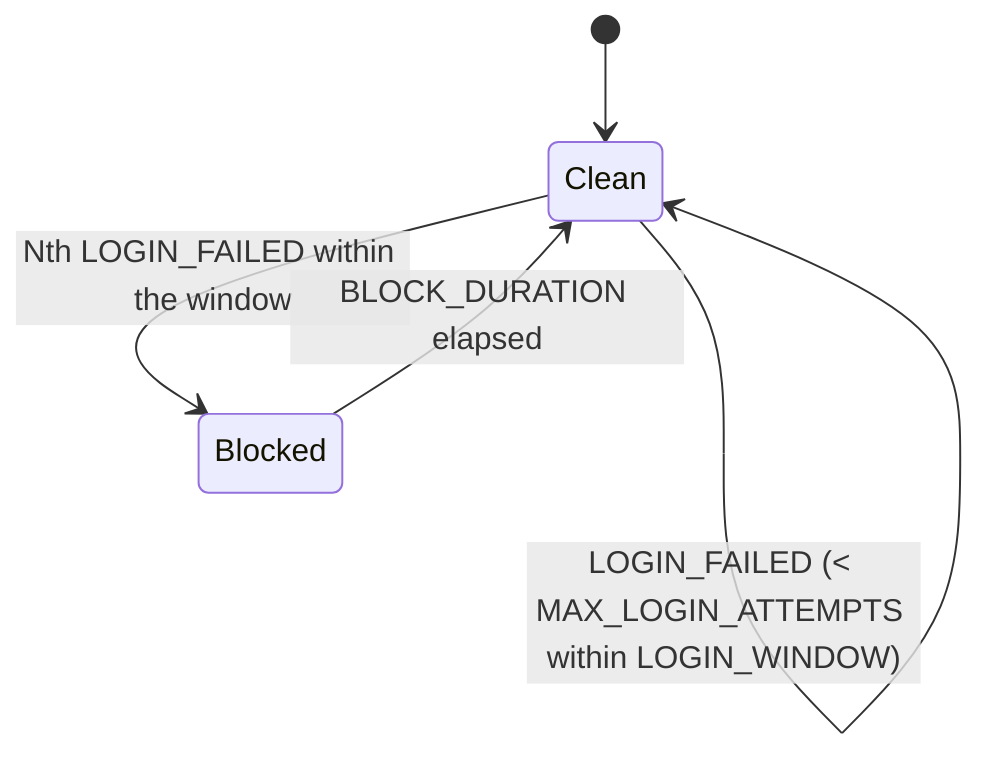

```mermaid
sequenceDiagram
    participant Client
    participant ChatServer
    participant AuthLoop as handle_new_connection
    Client->>ChatServer: TCP connect
    ChatServer->>AuthLoop: spawn thread, ssl.wrap_socket()
    AuthLoop->>Client: (waits for the first line)
    alt PING
        Client->>AuthLoop: PING
        AuthLoop->>Client: PONG
    else LOGIN/REGISTER
        Client->>AuthLoop: LOGIN user pass
        AuthLoop->>AuthLoop: authentication.login()
        AuthLoop->>ClientRegistry: registry.add(session)
        AuthLoop->>Client: OK Connected as ...
        AuthLoop->>AuthLoop: spawn handle_messages thread
    end
```

```mermaid
stateDiagram-v2
    [*] --> Clean
    Clean --> Clean: LOGIN_FAILED (< MAX_LOGIN_ATTEMPTS within LOGIN_WINDOW)
    Clean --> Blocked: Nth LOGIN_FAILED within the window
    Blocked --> Clean: BLOCK_DURATION elapsed
```

## Threading

- One `_accept_loop` thread accepts connections, spawning one `handle_new_connection` thread per client.
- After login, each client gets an additional `handle_messages` thread that continuously reads messages.
- Shared state is protected by:
  - `ClientRegistry._lock` — protects `_sessions`, `_by_name`, `_client_ips`, `_ip_counts`, `_writers`.
  - A bounded per-client send queue plus one dedicated writer thread (`_ClientWriter` in `client_registry.py`) — that writer thread is the only code that ever calls `sendall()`/`close()` on a given client's socket, so `broadcast()` (or any other thread) just enqueues a message instead of writing to the socket directly.
  - `SlidingWindowLimiter._lock` — protects rate-limit state (login/register/message flood).
